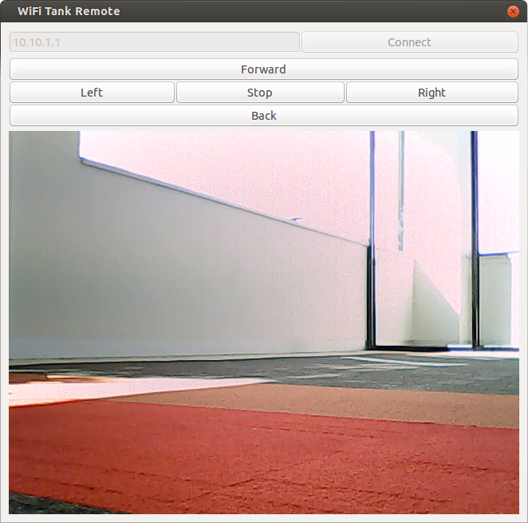

WiFi Spy Tank Remote
====================

A Python application to controll a [WiFi Spy Tank](https://www.kogan.com/au/buy/remote-control-spy-tank-ipad-iphone/) from your desktop!
The tank is also called "Instant Spy Tank".

You can buy one here: [https://www.kogan.com/au/buy/remote-control-spy-tank-ipad-iphone/](https://www.kogan.com/au/buy/remote-control-spy-tank-ipad-iphone/).



Installation
------------

For ubuntu:
```bash
sudo apt-get install python-gtk2
mkvirtualenv tank --system-site-packages
git clone https://github.com/mic159/TankRemote
cd TankRemote
pip install .

tank_remote
```
